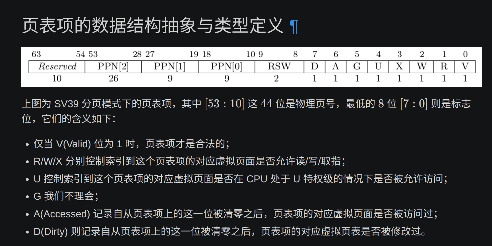

# rCore-Camp-2025s ch4报告

## 总结功能
1. 重写 sys_get_time 和 sys_trace

2. 实现 mmap 和 munmap 的申请内存功能

思路：

1. sys_trace

    系统调用计数的功能和ch3差不多，不过ch4实现了动态内存分配，所以可以直接用BTreeMap了。

    但是对于读写内存，trap进内核态之后_id中是用户空间的虚拟地址，存在跨地址空间的问题。所以要用translated_byte_buffer这个函数，在内核态直接读写用户地址空间的内容。

2. sys_get_time

    sys_get_time内核拿到了TimeVal的指针，但是这个指针地址是用户虚拟地址空间，同样有跨地址空间的问题，所以内核要处理，且TimeVal可能是跨页的，不过translated_byte_buffer能正确处理这些问题，直接用。

3. sys_mmap

    小细节的检查易于完成(例如检查_start是否页对齐)。主要的点：

    * 检查页是否已分配
        
        用page_table的find_pte()检查
    
    * 检查物理内存是否足够
        
        去FRAME_ALLOCATOR里算剩余页面数

    * 分配内存页

        用MemorySet的insert_framed_area()实现分配

4. sys_munmap

    用MapArea的vpn_range一个个检查要unmap的内存页是否对得上，然后用MapArea的unmap()完成功能

## 简答作业

### 1. 请列举 SV39 页表页表项的组成，描述其中的标志位有何作用？
[指导书](https://learningos.cn/rCore-Camp-Guide-2025S/chapter4/3sv39-implementation-1.html#id6)：



### 缺页
缺页指的是进程访问页面时页面不在页表中或在页表中无效的现象，此时 MMU 将会返回一个中断， 告知 os 进程内存访问出了问题。os 选择填补页表并重新执行异常指令或者杀死进程。

#### 请问哪些异常可能是缺页导致的？
[指导书](https://learningos.cn/rCore-Camp-Guide-2025S/chapter4/7exercise.html#id3)上直接回答了:

缺页有两个常见的原因，其一是 Lazy 策略，也就是直到内存页面被访问才实际进行页表操作。 比如，一个程序被执行时，进程的代码段理论上需要从磁盘加载到内存。但是 os 并不会马上这样做， 而是会保存 .text 段在磁盘的位置信息，在这些代码第一次被执行时才完成从磁盘的加载操作。

缺页的另一个常见原因是 swap 策略，也就是内存页面可能被换到磁盘上了，导致对应页面失效。

#### 这样做有哪些好处？（指Lazy 策略）
[指导书](https://learningos.cn/rCore-Camp-Guide-2025S/chapter4/7exercise.html#id3)上也直接回答了:

其实，我们的 mmap 也可以采取 Lazy 策略，比如：一个用户进程先后申请了 10G 的内存空间， 然后用了其中 1M 就直接退出了。按照现在的做法，我们显然亏大了，进行了很多没有意义的页表操作。

简而言之就是按实际需求分配，能提升利用率，减小进程的空间占用。

#### 发生缺页时，描述相关重要寄存器的值，上次实验描述过的可以简略。
涉及的重要寄存器和ch3差不多，trap.S中出现的那些

#### 处理 10G 连续的内存页面，对应的 SV39 页表大致占用多少内存 (估算数量级即可)？
[rcore tutorial](https://rcore-os.cn/rCore-Tutorial-Book-v3/chapter4/3sv39-implementation-1.html#id6)有分析页表的内存占用，在"分析 SV39 多级页表的内存占用"那部分。

结论为：设某个应用地址空间实际用到的区域总大小为 $S$ 字节，则地址空间对应的多级页表消耗内存为$ \frac{S}{512}$ 左右。

#### 请简单思考如何才能实现 Lazy 策略，缺页时又如何处理？描述合理即可，不需要考虑实现。
发生缺页异常时，检查页面是否为"合法但未分配物理页面"的状态，如果是则分配物理页面，然后回到用户态产生缺页的那条指令重新执行。

#### 此时页面失效如何表现在页表项(PTE)上？
用SV39页表项的保留字段RSW以标记页面为懒惰分配状态；或者valid位为0但X、W、R不为0，可以用来标记懒惰分配状态；或者在os/的代码中维护懒惰分配段。总之页表项V为0不一定是非法，可能只是懒惰还未分配。

### 双页表与单页表
为了防范侧信道攻击，我们的 os 使用了双页表。但是传统的设计一直是单页表的，也就是说， 用户线程和对应的内核线程共用同一张页表，只不过内核对应的地址只允许在内核态访问。 (备注：这里的单/双的说法仅为自创的通俗说法，并无这个名词概念，详情见 [KPTI](https://en.wikipedia.org/wiki/Kernel_page-table_isolation) )

关于单页表和双页表的解释，见[rcore tutorial](https://rcore-os.cn/rCore-Tutorial-Book-v3/chapter4/6multitasking-based-on-as.html#term-trampoline)，"内核与应用地址空间的隔离"一段：
```
目前我们的设计思路 A 是：对内核建立唯一的内核地址空间存放内核的代码、数据，同时对于每个应用维护一个它们自己的用户地址空间，因此在 Trap 的时候就需要进行地址空间切换，而在任务切换的时候无需进行（因为这个过程全程在内核内完成）。

另外的一种设计思路 B 是：让每个应用都有一个包含应用和内核的地址空间，并将其中的逻辑段分为内核和用户两部分，分别映射到内核/用户的数据和代码，且分别在 CPU 处于 S/U 特权级时访问。此设计中并不存在一个单独的内核地址空间。
```

#### 在单页表情况下，如何更换页表？
应该是不用更改satp寄存器，进内核态就行了，不需要更换页表。

#### 单页表情况下，如何控制用户态无法访问内核页面？
SV39页表项的U位可以控制。

#### 单页表有何优势？（回答合理即可）
页表切换的次数少，切换页表时让tlb失效的sfence.vma指令开销应该较大，可以减少这个。

#### 双页表实现下，何时需要更换页表？假设你写一个单页表操作系统，你会选择何时更换页表（回答合理即可）？
双页表实现，trap进内核态和从内核态返回用户态都需要切换页表(trap.S中可以看到)。

单页表实现，发生进程切换时才需要切换页表。

## 荣誉准则
1. 在完成本次实验的过程（含此前学习的过程）中，我曾分别与以下各位就（与本次实验相关的）以下方面做过交流，还在代码中对应的位置以注释形式记录了具体的交流对象及内容：

    rcore-camp群友

2. 此外，我也参考了以下资料 ，还在代码中对应的位置以注释形式记录了具体的参考来源及内容：

    问chatgpt和deepseek相关内容

3. 我独立完成了本次实验除以上方面之外的所有工作，包括代码与文档。 我清楚地知道，从以上方面获得的信息在一定程度上降低了实验难度，可能会影响起评分。

4. 我从未使用过他人的代码，不管是原封不动地复制，还是经过了某些等价转换。 我未曾也不会向他人（含此后各届同学）复制或公开我的实验代码，我有义务妥善保管好它们。 我提交至本实验的评测系统的代码，均无意于破坏或妨碍任何计算机系统的正常运转。 我清楚地知道，以上情况均为本课程纪律所禁止，若违反，对应的实验成绩将按“-100”分计。